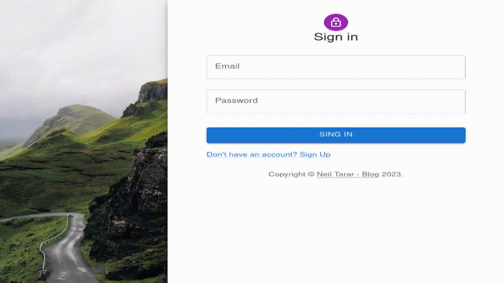

# :rocket: Express-React-JWT-Auth Boilerplate

This project provides a jumpstart for building a full-stack web application with secure authentication using Express, React, TypeScript, and JSON Web Tokens (JWT). The boilerplate includes sign-in and sign-up pages.

In the users table, each new user record includes an `is_activated` field. After creating a new user, remember to manually set this field to true to activate the user in the database. Until a user is `activated`, they will not be able to log in.

## :computer: Live Demo

I will serve the project from my server for a demo soon.


## :page_facing_up: About

This project is a boilerplate for creating a full-stack web application. It implements secure authentication using JWT, with user registration and sign-in functionality included.

<details>
    <summary> 
        <strong> :wrench: Build </strong>
    </summary>

To get started with this boilerplate, clone the project with the following commands:

```zsh
$ git clone git@github.com:neiltarar/express-react-jwt-auth-boilerplate.git
$ cd express-react-jwt-auth-boilerplate
```

If you are using React, just add your pages and build. If not, your static assets need to replace the build folder in auth-server.

To build the dashboard:

1. Navigate to the 'auth-dashboard' directory:

```zsh
$ cd auth-dashboard
```

2. Run the build command:

```zsh
$ npm i
$ npm run build
```

This will generate a 'build' folder in the 'auth-server' directory with the compiled static assets. Replace the existing 'build' folder in the server with your own static assets if you are not using React.

3. Install the dependencies for the server app

```zsh
$ cd auth-server
$ npm i
$ npm start
```

</details>

## :star: Features

The project includes the following features:

- User Registration
- User Sign-in
- Secure Authentication using JWT
- Front-end built with React and TypeScript
- Back-end built with Express.js

## :wrench: Tech Stack

- React.js: JavaScript library for building user interfaces.
- Express.js: Fast, unopinionated, minimalist web framework for Node.js.
- TypeScript: A strict syntactical superset of JavaScript which adds static typing.
- JWT: JSON Web Tokens for securely transmitting information between parties as a JSON object.

## :gear: Implementation Details

The project uses bcrypt for password hashing and JSON Web Tokens (JWT) for maintaining session information.

On the server side, we check if a user exists and is activated. If so, we verify the password. Upon successful verification, we generate access and refresh tokens, delete any existing refresh tokens for the user, and save the new refresh token.

On the client side, we make sure to redirect non-authenticated users to the sign-in page. Users have the option to log out, which clears the stored tokens.

## :construction: Future Scope

There is always room for improvements and additional features! Here are some potential areas for expansion:

Implementing a "Forgot Password" functionality.
Enhancing the UI/UX of the application.
Integrating third-party authentication methods (like Google, Facebook, etc.).
Enabling Email Verification on User Registration.
